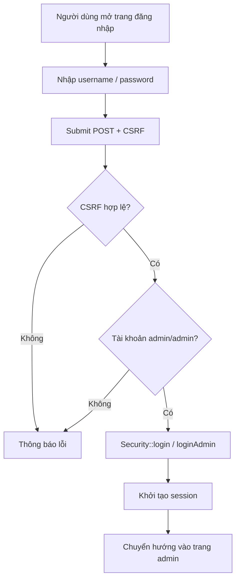
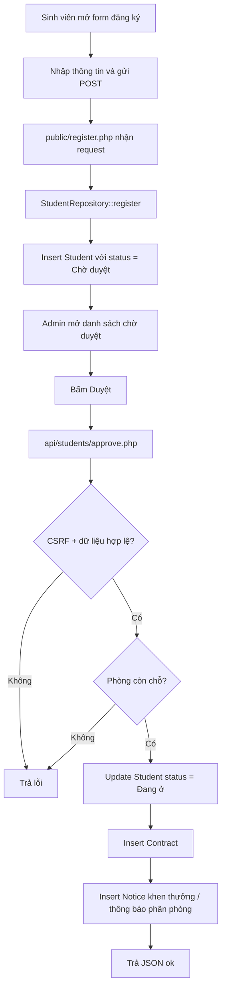
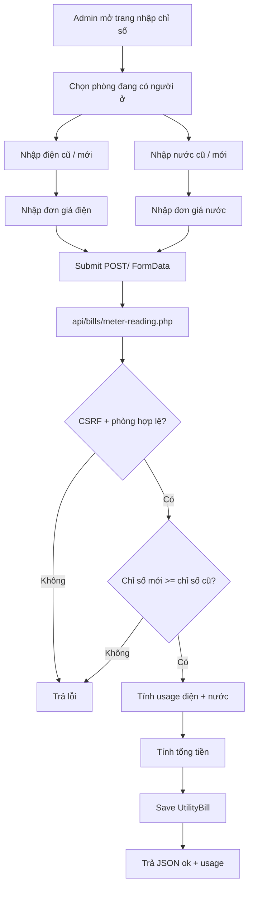
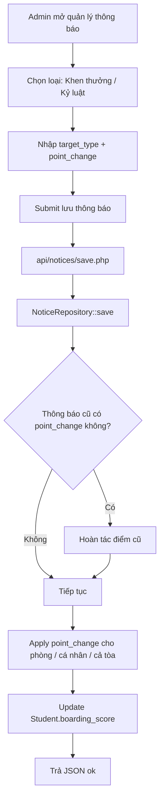

# SYSTEM_FLOW

Tài liệu này mô tả luồng hoạt động chính của hệ thống Quản lý Ký túc xá. Mục tiêu là giúp người đọc hiểu request đi qua file nào, dữ liệu được xử lý ở đâu, và hệ thống cập nhật database như thế nào.

## 1. Luồng đăng nhập và phân quyền

### Mô tả ngắn
- Người dùng vào trang đăng nhập.
- Form gửi `POST` kèm `username`, `password`, `csrf_token`.
- Hệ thống kiểm tra CSRF trước.
- Nếu đúng tài khoản `admin/admin`, hệ thống tạo session.
- Sau khi đăng nhập thành công, admin được chuyển vào khu vực quản trị.
- Nếu không hợp lệ, hệ thống trả lỗi và giữ lại màn hình đăng nhập.

### File liên quan
- [public/login.php](public/login.php)
- [public/admin/login.php](public/admin/login.php)
- [views/auth/login.php](views/auth/login.php)
- [core/Security.php](core/Security.php)

### Mermaid

### Giải thích để bảo vệ đồ án
- `public/login.php` là điểm vào của trang đăng nhập public.
- `public/admin/login.php` là trang đăng nhập riêng cho admin.
- `Security::verifyCsrfToken()` giúp chống request giả mạo.
- `Security::login()` hoặc `Security::loginAdmin()` lưu thông tin người dùng vào session.
- `Security::requireAdminAuth()` được dùng ở các trang quản trị để chặn truy cập trái phép.

---

## 2. Luồng sinh viên đăng ký giữ chỗ -> Admin duyệt -> tạo hợp đồng

### Mô tả ngắn
- Sinh viên điền form đăng ký trên trang public.
- Dữ liệu được lưu vào bảng `Student` với trạng thái `Chờ duyệt`.
- Admin mở bảng sinh viên chờ duyệt.
- Khi bấm duyệt, hệ thống kiểm tra sinh viên, phòng, sức chứa.
- Nếu hợp lệ, hệ thống cập nhật trạng thái sinh viên thành `Đang ở`.
- Hệ thống tạo bản ghi `Contract` tương ứng với phòng được gán.
- Đồng thời tạo `Notice` thông báo sinh viên đã được phân phòng.

### File liên quan
- [public/register.php](public/register.php)
- [api/students/approve.php](api/students/approve.php)
- [public/admin/students.php](public/admin/students.php)
- [models/StudentRepository.php](models/StudentRepository.php)
- [models/ContractRepository.php](models/ContractRepository.php)
- [models/RoomRepository.php](models/RoomRepository.php)
- [models/NoticeRepository.php](models/NoticeRepository.php)

### Mermaid

### Giải thích để bảo vệ đồ án
- Sinh viên chỉ đăng ký thông tin, chưa tạo hợp đồng ngay.
- Hợp đồng chỉ xuất hiện khi admin duyệt hồ sơ và gán phòng.
- `api/students/approve.php` đang xử lý theo transaction để tránh lỗi nửa chừng.
- `Contract` là mối liên kết giữa sinh viên và phòng ở.
- Khi duyệt xong, `status` của sinh viên đổi thành `Đang ở` để phục vụ dashboard và lọc danh sách.

---

## 3. Luồng quản lý hóa đơn điện/nước hàng tháng cho phòng

### Mô tả ngắn
- Admin mở trang nhập chỉ số điện nước.
- Chỉ chọn các phòng đang có sinh viên ở.
- Nhập chỉ số cũ và mới cho điện riêng, nước riêng.
- Hệ thống kiểm tra chỉ số mới phải lớn hơn hoặc bằng chỉ số cũ.
- Hệ thống tính lượng tiêu thụ và tổng tiền phải trả.
- Lưu hóa đơn vào `UtilityBill` theo tháng/năm.
- Trang tra cứu hóa đơn public cho phép xem danh sách hóa đơn theo phòng.

### File liên quan
- [public/admin/meter-reading.php](public/admin/meter-reading.php)
- [api/bills/meter-reading.php](api/bills/meter-reading.php)
- [public/bill-inquiry.php](public/bill-inquiry.php)
- [models/UtilityBillRepository.php](models/UtilityBillRepository.php)
- [models/RoomRepository.php](models/RoomRepository.php)

### Mermaid

### Giải thích để bảo vệ đồ án
- Giao diện tách riêng điện và nước để đúng nghiệp vụ thực tế.
- Số tiền hóa đơn được tính động thay vì nhập tay toàn bộ.
- `UtilityBillRepository::existsForRoomAndMonthYear()` giúp tránh tạo trùng hóa đơn trong cùng tháng.
- `bill-inquiry.php` cho phép người dùng tra cứu lại theo phòng.

---

## 4. Luồng chấm điểm nội trú (khen thưởng / kỷ luật)

### Mô tả ngắn
- Admin tạo hoặc sửa một thông báo trong mục quản lý thông báo.
- Thông báo có thể áp dụng cho cả tòa, một phòng, hoặc một sinh viên.
- Trường `point_change` xác định số điểm cộng hoặc trừ.
- Khi lưu, hệ thống cộng/trừ vào `boarding_score` của các sinh viên liên quan.
- Khi xóa hoặc sửa thông báo, hệ thống hoàn tác điểm cũ trước khi áp dụng điểm mới.

### File liên quan
- [public/admin/notices.php](public/admin/notices.php)
- [api/notices/save.php](api/notices/save.php)
- [api/notices/delete.php](api/notices/delete.php)
- [models/NoticeRepository.php](models/NoticeRepository.php)
- [models/StudentRepository.php](models/StudentRepository.php)

### Mermaid

### Giải thích để bảo vệ đồ án
- `boarding_score` là điểm nội trú thực tế của sinh viên.
- `point_change` có thể dương hoặc âm.
- Khi xóa thông báo, hệ thống phải rollback điểm đã cộng/trừ để tránh lệch dữ liệu.
- Đây là điểm quan trọng để chứng minh hệ thống có nghiệp vụ trạng thái và bù trừ dữ liệu.

---

## 5. Tóm tắt nhanh luồng dữ liệu

- Public tạo dữ liệu gốc: đăng ký sinh viên, tra cứu hóa đơn.
- Admin duyệt hồ sơ để sinh viên thành nội trú.
- Contract ghi nhận quan hệ sinh viên - phòng - công nợ.
- UtilityBill ghi nhận hóa đơn điện nước theo từng tháng.
- Notice dùng để quản lý thông báo và điểm nội trú.

## 6. Điểm có thể nhấn mạnh khi trình bày
- Hệ thống theo mô hình PHP thuần, nhưng vẫn tách lớp rõ ràng để dễ bảo trì.
- Mỗi request quan trọng đều đi qua CSRF và session.
- SQL được thực hiện bằng PDO, giảm nguy cơ SQL injection.
- Tính tiền hợp đồng và tính hóa đơn điện nước đều được xử lý động bằng PHP.
- Các luồng có ảnh hưởng dữ liệu lớn đều dùng transaction để giảm rủi ro lỗi nửa chừng.
